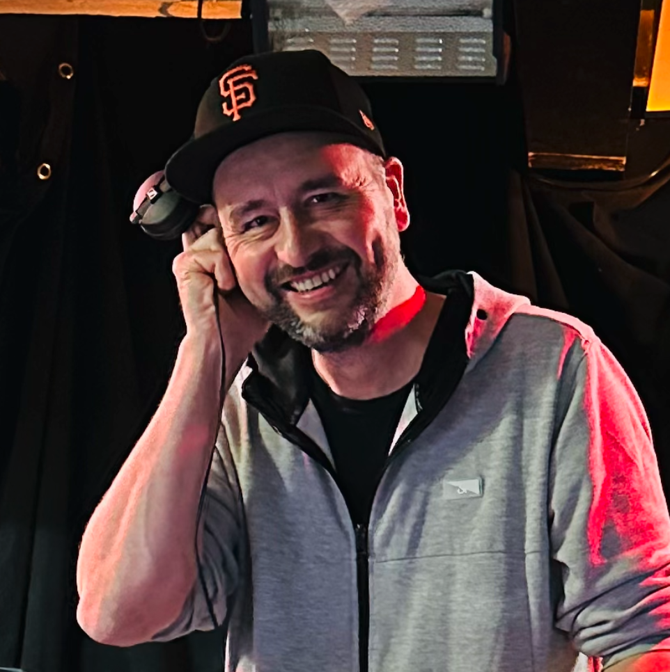

Timings and session details are provided below. All times are in local time (i.e., **UTC+1**).

<table style="margin-left: 1em;">
<tbody>
<tr><td>9:00</td><td>- Coffee / Pastries</td></tr>
<tr><td>9:25</td><td>- Welcome </td></tr>
<tr><td>9:35</td><td>- <a href="#keynote">Keynote - Bernd T Meyer</a></td></tr>
<tr><td>10:25</td><td>- <a href="#overview">The Clarity Prediction Challenge Overview + Prizes</a></td></tr>
<tr><td>10:50</td><td>- Coffee/Tea/Pastries</td></tr>
<tr><td>11:10</td><td>- <a href="#poster">Prediction Challenge Poster session</a></td></tr>
<tr><td>12:10</td><td>- <a href="#oral1">Prediction Challenge Oral session</a></td></tr>
<tr><td>13:10</td><td>- Lunch</td></tr>
<tr><td>14:00</td><td>- <a href="#discussion">ISAAR/Clarity Discussion</a></td></tr>
<tr><td></td><td>Future challenges</td></tr>
<tr><td></td><td>Sustainability of future challenge activities</td></tr>
<tr><td>15:00</td><td>- Coffee/Tea  (Posters Cont)</td></tr>
<tr><td>15:20</td><td>- <a href="#oral2">Oral Session / Hearing Aid Speech Enhancement + Other Topics </a> </td></tr>
<tr><td>17:00</td><td>- <a href="#next">Next steps</a></td></tr>
<tr><td></td><td>From spoken speech to sung speech - Cadenza Lyric Challenge</td></tr>
<tr><td></td><td>Conversation in noise  - CHiME-9 ECHI Challenge</td></tr>
<tr><td>17:20</td><td>- Close</td></tr>

</tbody>
</table>

<h1 id="keynote">Invited Talk</h1>

  

<h1 class="lead">Bernd T Meyer 
University of Oldenburg, Germany
 </h1>

<h1> Machine learning for computational audiology: Prediction of auditory perception and improvement of speech signals based on deep learning </h1>

<button class="btn btn-primary" style="color:white; margin: 10px; border-radius: 4px;" type="button" data-toggle="collapse" data-target="#collapseAbstractMeyer" aria-expanded="false" aria-controls="collapseAbstractMeyer">
Abstract + Bio
</button>

<!---------------------------------------------------->

<h1 class="card-title"> Machine learning for computational audiology: Prediction of auditory perception and improvement of speech signals based on deep learning  </h1>

<h2>Abstract</h2>

To appear.

<h2>Bio</h2>

Bernd T. Meyer received the Ph.D. degree from the University of Oldenburg, Germany, in 2009, where he was a member of the Medical Physics Group. He was a Visiting Researcher in the speech group with the International Computer Science Institute, Berkeley, CA, USA, and worked in the Center for Language and Speech Processing at the Johns Hopkins University, Baltimore, MD, USA. Since 2019, he is professor for Communication Acoustics at the University Oldenburg. His research interests include the relation of speech and hearing, with a special interest in models of human speech perception, automatic speech processing and its applications in hearing technology.

<!---------------------------------------------------->

<h1 id="overview">Clarity Prediction Challenge</h1>

<h2> Overview </h2>

<table>
<tbody>

<tr><td valign="top" style="margin-right: 5em; padding: 5px;"></td>
<td valign="top" style="margin-right: 5em; padding: 5px;">10:30-10:50</td><td style="padding: 5px;"><b> The 3rd Clarity Prediction Challenge: A machine learning challenge for hearing aid intelligibility prediction </b>   Jon Barker1, Michael A. Akeroyd2, Trevor J. Cox3, John F. Culling4, Jennifer Firth2, Simone Graetzer3 and Graham Naylor2<i> ( 1University of Sheffield; 2University of Nottingham; 3University of Salford; 4Cardiff University)</i> </td>
</tr>

</tbody>
</table>

<h2 id="poster"> Poster Session </h2>

Session Chair: Jennifer Firth

<table>
<tbody>

<tr><td valign="top" style="margin-right: 5em; padding: 5px;"></td>
<td valign="top" style="margin-right: 5em; padding: 5px;">11:10-12:10</td><td style="padding: 5px;"><b> The CPC3 Poster Session
  </b> </td>
</tr>

<tr><td valign="top" style="margin-right: 5em; padding: 5px;"></td>
<td valign="top" style="margin-right: 5em; padding: 5px;">Poster 1</td><td style="padding: 5px;"><b> Non-Intrusive Multi-Branch Speech Intelligibility Prediction using Multi-Stage Training  </b>   Ryandhimas E. Zezario1, Szu-Wei Fu2, Dyah A.M.G. Wisnu1,3, Hsin-Min Wang1, Yu Tsao1 <i>( 1Academia Sinica; 2NVIDIA; 3National Chengchi University)</i></td>
</tr>

<tr><td valign="top" style="margin-right: 5em; padding: 5px;"></td>
<td valign="top" style="margin-right: 5em; padding: 5px;">Poster 2</td><td style="padding: 5px;"><b> Domain-Adapted Automatic Speech Recognition with Deep Neural Networks for Enhanced Speech Intelligibility Prediction  </b>  Haeseung Jeon1, Jiwoo Hong1, Saeyeon Hong1, Hosung Kang1, Bona Kim1, Se Eun Oh1,
and Noori Kim2 <i>( 1Ewha Womans University, South Korea; 2Purdue University, US )</i></td>
</tr>

<tr><td valign="top" style="margin-right: 5em; padding: 5px;"></td>
<td valign="top" style="margin-right: 5em; padding: 5px;">Poster 3</td><td style="padding: 5px;"><b> Predicting Intelligibility for Hearing-Impaired Listeners via Explicit Scores and Pre-trained Feature  </b>  Hanglei Zhang, Yanchen Li, Xiang Hao, Yufei Zhang, Jibin Wu, Kay Chen Tan <i>(Hong Kong Polytechnic University, China)</i></td>
</tr>

<tr><td valign="top" style="margin-right: 5em; padding: 5px;"></td>
<td valign="top" style="margin-right: 5em; padding: 5px;">Poster 4</td><td style="padding: 5px;"><b> Non-Intrusive Speech Intelligibility Prediction Using Whisper ASR and Wavelet Scattering Embeddings for Hearing-Impaired Individuals  </b>  Rantu Buragohain1, Jejariya Ajaybhai1, Aashish Kumar Singh1, Karan Nathwani1, Sunil Kumar
Kopparapu2 <i>( 1Indian Institute of Technology Jammu, India; 2Tata Consultancy Services Limited Mumbai, India)</i></td>
</tr>

<tr><td valign="top" style="margin-right: 5em; padding: 5px;"></td>
<td valign="top" style="margin-right: 5em; padding: 5px;">Poster 5</td><td style="padding: 5px;"><b> Integrating Linguistic and Acoustic Cues for Machine Learning-Based Speech Intelligibility Prediction in Hearing Impairment  </b>  Candy Olivia Mawalim, Xiajie Zhou, Huy Quoc Nguyen, Masashi Unoki <i>(JAIST, Japan)</i></td>
</tr>

<tr><td valign="top" style="margin-right: 5em; padding: 5px;"></td>
<td valign="top" style="margin-right: 5em; padding: 5px;">Poster 6</td><td style="padding: 5px;"><b> OSQA-SI: A Lightweight Non-Intrusive Analysis Model for Speech Intelligibility Prediction  </b>  Hsing-Ting, Chen, Po-Hsun Sung <i>(Merry Electronics Co.)</i></td>
</tr>

<tr><td valign="top" style="margin-right: 5em; padding: 5px;"></td>
<td valign="top" style="margin-right: 5em; padding: 5px;">Poster 7</td><td style="padding: 5px;"><b> Non-intrusive Speech Intelligibility Prediction Model for Hearing Aids using Multi-domain Fused Features  </b>  Guojian Lin, Fei Chen <i>(Southern University of Science and Technology, Shenzhen, China)</i></td>
</tr>

<tr><td valign="top" style="margin-right: 5em; padding: 5px;"></td>
<td valign="top" style="margin-right: 5em; padding: 5px;">Poster 8</td><td style="padding: 5px;"><b> Word-level intelligibility model for the third Clarity Prediction Challenge  </b>  Mark Huckvale <i>(University College London, UK)</i></td>
</tr>

<tr><td valign="top" style="margin-right: 5em; padding: 5px;"></td>
<td valign="top" style="margin-right: 5em; padding: 5px;">Poster 9</td><td style="padding: 5px;"><b> A Chorus of Whispers: Modeling Speech Intelligibility via Heterogeneous Whisper Decomposition  </b>  Longbin Jin, Donghun Min, Eun Yi Kim <i>(Konkuk University, South Korea)</i></td>
</tr>

<tr><td valign="top" style="margin-right: 5em; padding: 5px;"></td>
<td valign="top" style="margin-right: 5em; padding: 5px;">Poster 10</td><td style="padding: 5px;"><b> Speech intelligibility prediction based on syllable tokenizer  </b>  Szymon Drgas <i>(Poznan University of Technology, Poland)</i></td>
</tr>

<tr><td valign="top" style="margin-right: 5em; padding: 5px;"></td>
<td valign="top" style="margin-right: 5em; padding: 5px;">Poster 11</td><td style="padding: 5px;"><b> Modeling normal and impaired hearing with deep neural networks optimized for ecological tasks </b>  Mark R. Saddler1, Torsten Dau1, Josh H. McDermott2 <i>( 1DTU, Denmark; 2MIT, US)</i></td>
</tr>

</tbody>
</table>

<h2 id="oral1"> Oral Session </h2>

Session Chair: Jon Barker

<table>
<tbody>

<tr><td valign="top" style="margin-right: 5em; padding: 5px;"></td>
<td valign="top" style="margin-right: 5em; padding: 5px;">12:10-12:30</td><td style="padding: 5px;"><b> Lightweight Speech Intelligibility Prediction with Spectro-Temporal Modulation for Hearing-Impaired Listeners
  </b>  Xiajie Zhou, Candy Olivia Mawalim, Huy Quoc Nguyen, Masashi Unoki <i>(JAIST, Japan)</i> </td>
</tr>

<tr><td valign="top" style="margin-right: 5em; padding: 5px;"></td>
<td valign="top" style="margin-right: 5em; padding: 5px;">12:30-12:50</td><td style="padding: 5px;"><b> Intrusive Intelligibility Prediction with ASR Encoders
  </b>   Hanlin Yu1, Haoshuai Zhou2, Linkai Li2,3, Boxuan Cao2, Changgeng Mo2, Shan Xiang Wang3 <i>( 1University of British Columbia,Canada; 2Orka Labs Inc., China; 3Stanford University, US)</i> </td>
</tr>

<tr><td valign="top" style="margin-right: 5em; padding: 5px;"></td>
<td valign="top" style="margin-right: 5em; padding: 5px;">12:50-13:10</td><td style="padding: 5px;"><b> Towards individualized models of hearing-impaired speech perception
  </b>   Mark R. Saddler1, Torsten Dau1, Josh H. McDermott2 <i>( 1DTU, Denmark; 2MIT, US)</i> </td>
</tr>

</tbody>
</table>

<!---------------------------------------------------->

<h1 id="discussion">ISAAR/Clarity Discussion Session</h1>

Session Chair: Simone Graetzer

There will be a one hour discussion session that will link up the International Symposium on Auditory and Audiological Research (<a href="https://isaar.eu/">ISAAR-2025</a>) and the Clarity workshop. The discussion will bring speech and hearing researchers together to discuss the future priorities for hearing device machine learning challenges. What are the needs of hearing device users? What opportunities does machine learning provide for addressing these needs?

<table>
<tbody>

<tr><td valign="top" style="margin-right: 5em; padding: 5px;"></td>
<td valign="top" style="margin-right: 5em; padding: 5px;">14:00-14:10</td><td style="padding: 5px;"><b> Opening Remarks: ISAAR Workshop
  </b> </td> </tr>

<tr><td valign="top" style="margin-right: 5em; padding: 5px;"></td>
<td valign="top" style="margin-right: 5em; padding: 5px;">14:10-14:20</td><td style="padding: 5px;"><b> Opening Remarks: Clarity Workshop
  </b> </td> </tr>

<tr><td valign="top" style="margin-right: 5em; padding: 5px;"></td>
<td valign="top" style="margin-right: 5em; padding: 5px;">14:20-14:50</td><td style="padding: 5px;"><b> Discussion
  </b> </td> </tr>

<tr><td valign="top" style="margin-right: 5em; padding: 5px;"></td>
<td valign="top" style="margin-right: 5em; padding: 5px;">14:50-15:00</td><td style="padding: 5px;"><b> Summary/Conclusion
  </b> </td> </tr>

</tbody>
</table>

Further session details to appear.

<!---------------------------------------------------->

<h1 id="oral2">Hearing Aid Speech Enhancement + Other Topics</h1>

Session Chair: Jesper Jensen

The session will consist of oral presentations each of up to 20 minutes with 5 minutes for Q&A.

<table>
<tbody>

<tr><td valign="top" style="margin-right: 5em; padding: 5px;"></td>
<td valign="top" style="margin-right: 5em; padding: 5px;">15:20-15:45</td><td style="padding: 5px;"><b> The Dawn of Psychoacoustic Reverse Correlation: A Data-Driven Methodology for Determining Fine Grained Perceptual Cues of Speech Clarity
  </b>  Paige Tuttösi1, Henny Yeung1, Yue Wang1, Jean-Julien Aucouturier2, Angelica Lim1
 ( <i>1Simon Fraser University, US; 2Institut FEMTO-ST, France</i>)</td>
</tr>

<tr><td valign="top" style="margin-right: 5em; padding: 5px;"></td>
<td valign="top" style="margin-right: 5em; padding: 5px;">15:45-16:10</td><td style="padding: 5px;"><b> TF-MLPNet: Tiny Real-Time Neural Speech Separation  </b>  Malek Itani, Tuochao Chen, Shyam Gollakota  (<i>University of Washington, US</i>)</td>
</tr>

<tr><td valign="top" style="margin-right: 5em; padding: 5px;"></td>
<td valign="top" style="margin-right: 5em; padding: 5px;">16:10-16:35</td><td style="padding: 5px;"><b> Controllable joint noise reduction and hearing loss compensation using a differentiable auditory model  </b>  Philippe Gonzalez, Tobias May, Torstan Dau <i>(Technical University of Denmark)</i></td>
</tr>

<tr><td valign="top" style="margin-right: 5em; padding: 5px;"></td>
<td valign="top" style="margin-right: 5em; padding: 5px;">16:35-17:00</td><td style="padding: 5px;"><b> Say Who You Want to Hear: Leveraging TTS Style Embeddings for Text-Guided Speech Extraction  </b>  Akam Rahimil, Triantafyllos Afouras, Andrew Zisserman <i>(University of Oxford, UK)</i></td>
</tr>

</tbody>
</table>

<!---------------------------------------------------->

<h1 id="next">Next Steps</h1>

Presenting upcoming/ongoing machine challenges relevant to the community.

<table>
<tbody>

<!--
Session chair: <i>TBC</i>
-->

<tr><td valign="top" style="margin-right: 5em; padding: 5px;"></td>
<td valign="top" style="margin-right: 5em; padding: 5px;">17:00-17:10</td><td style="padding: 5px;"><b> From spoken speech to sung speech - Cadenza Lyric Challenge
  </b>   Micheal Akeroyd2, Scott Bannister1, Jon Barker4, Trevor Cox3, Bruno Fazenda3, Simone Graetzer3, Alinka Greasley1, Gerardo Roa4, Rebecca Vos3, William Whitmer2  ( <i>1University of Leeds, UK; 2University of Nottingham, UK; 3University of Salford, UK; 4University of Sheffield, UK</i>)</td>
</tr>

<tr><td valign="top" style="margin-right: 5em; padding: 5px;"></td>
<td valign="top" style="margin-right: 5em; padding: 5px;">17:10-17:20</td><td style="padding: 5px;"><b> Processing conversations in noise - CHiME-9 ECHI Challenge
  </b>   Jon Barker1, Stefan Goetze1, Robert Sutherland1, Marko Lugger2, Thomas Kuebert2, Stefan Petrausch2, Juan Azcarreta Ortiz3, Buye Xu3  ( <i> 1University of Sheffield, UK; 2WSAudiology, Germany; 3Meta Reality Labs Research, UK</i>)</td>
</tr>

</tbody>
</table>

